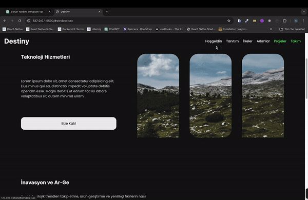

<h1> Destiny-HTML5/CSS3 </h1>

In this project, I have developed a multi-page professional company introduction web application using HTML, CSS and JavaScript. The project was meticulously designed to present our company in a modern and impactful manner to visitors.

Within the application, we showcase the services offered by our company, introduce our team members, and provide essential contact information. Each page is enriched with a user-friendly interface and visual elements to effectively present information in an engaging way.

<h2> The technologies used in the project </h2>

It was coded using Html5, Css3 and JavaScript technologies.

<h2> Demo </h2>

You can view a live demo of this project [here]( ).

<h2> Screenshot </h2>

# DestinyCompany-HTML5-CSS3
